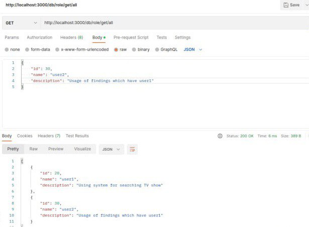
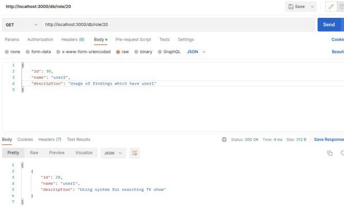
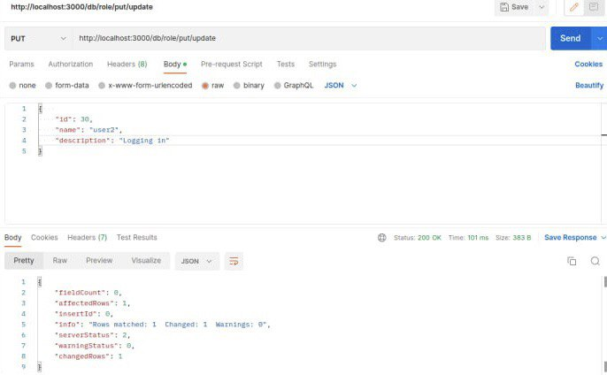

# Тестування працездатності системи

## Створення процесу role POST

**Запит**

## Зчитування процесу role по ID GET

**Запит та результат**

## Оновлення процесу PUT

**Запит**

**Результат**

## Видалення DELETE

**Запит та результат**

